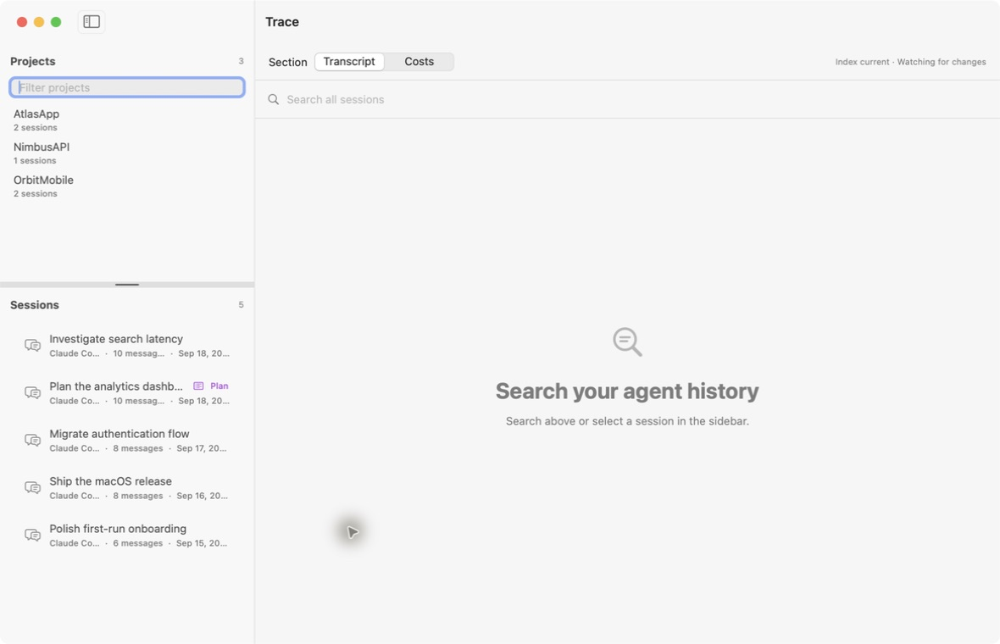
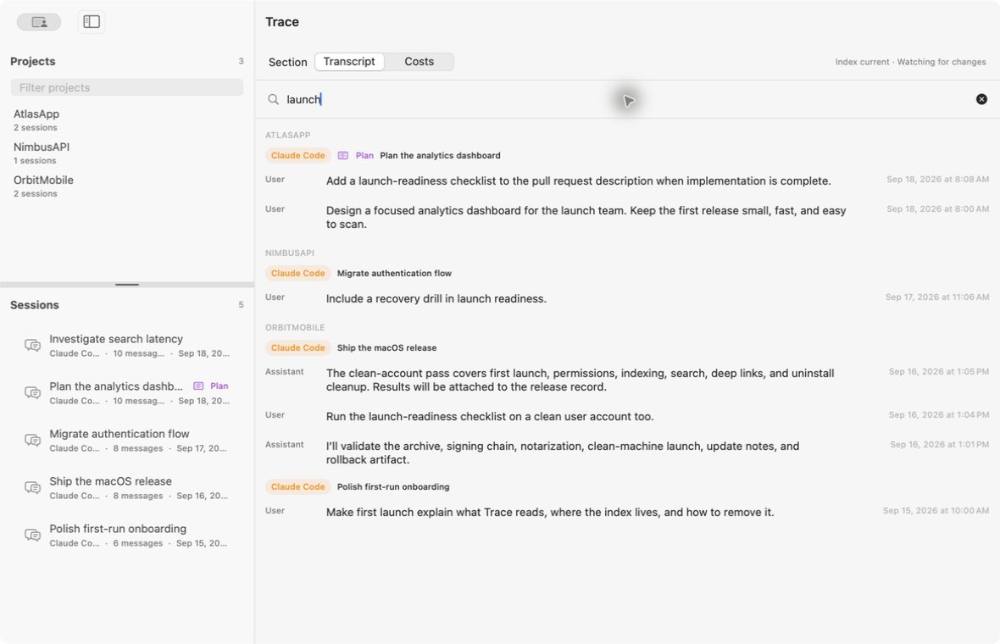
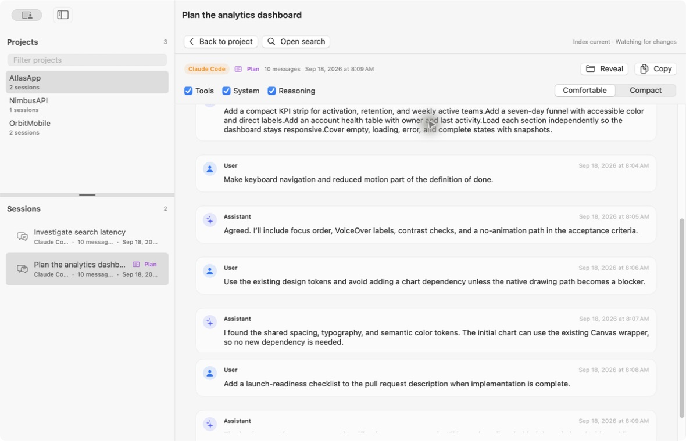
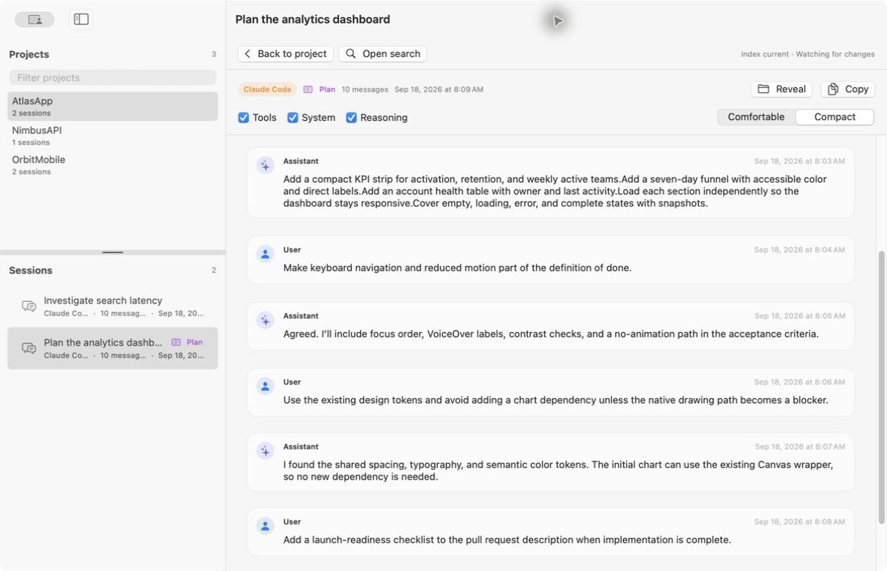

# Trace

**A native, private search and reading interface for your local AI coding
sessions.**

Trace brings Claude Code, Codex, and Gemini CLI history into one macOS app. It
builds a disposable SQLite/FTS5 index from the session files already on your
Mac, then lets you browse projects, search across transcripts, and return to the
exact message you need.

Trace is deliberately local and read-only. It has no account, cloud service,
updater, telemetry upload, or runtime network feature.

## Highlights

- Search Claude Code, Codex, and Gemini CLI sessions from one interface.
- Browse by project and session, with provider, message count, timestamp, and
  generated-plan metadata.
- Jump from a search result directly to the matching message in its transcript.
- Show or hide tool calls, system records, and reasoning independently.
- Switch between comfortable and compact transcript layouts.
- Copy a full visible transcript or the complete content of one message.
- Follow new and changed session files with incremental, checkpointed indexing.
- Keep source transcripts untouched and rebuild the local index at any time.

## Showcase

These screenshots were captured from the real app using an isolated, generated
fixture. They contain no private session data.

<table>
  <tr>
    <td width="50%" valign="top">
      
      <br><strong>Browse projects and sessions</strong><br>
      Move between provider sessions while keeping project and session context
      visible in the resizable sidebar.
    </td>
    <td width="50%" valign="top">
      
      <br><strong>Search across local history</strong><br>
      See relevant messages grouped by project and session, with provider and
      timestamp context.
    </td>
  </tr>
  <tr>
    <td width="50%" valign="top">
      
      <br><strong>Read the surrounding conversation</strong><br>
      Open a result at its matching message and continue through the complete
      transcript.
    </td>
    <td width="50%" valign="top">
      
      <br><strong>Fit more context on screen</strong><br>
      Compact display reduces message insets and spacing without hiding
      transcript controls or metadata.
    </td>
  </tr>
</table>

## Supported sources

| Provider | Default source | Supported session files |
| --- | --- | --- |
| Claude Code | `~/.claude/projects` | JSONL |
| Codex | `~/.codex/sessions` | `rollout-*.jsonl` |
| Gemini CLI | `~/.gemini/tmp` | JSON and JSONL |

Trace discovers these locations during onboarding. Missing providers are fine;
you can build an index from any combination of available sources.

## How Trace works

1. Trace discovers the selected local agent directories.
2. You choose whether search should include prose only, prose and tool
   invocations, or everything except reasoning. Reasoning is never added to the
   search index.
3. Trace parses session metadata and messages into a disposable local database
   with FTS5 search.
4. A file watcher schedules incremental passes as sessions are created or
   appended. Source files always remain read-only.
5. Search results retain enough project, session, and message context to open
   the original conversation at the relevant point.

Deleting the index is safe. The next build recreates it from the source files;
Trace does not maintain a separate transcript archive.

## Using Trace

### Browse and search

The Projects filter matches project names. Selecting a project narrows the
session list and clears any open transcript. Drag the horizontal divider to
resize the Projects and Sessions panes.

The main search field searches the selected project, while global search stays
available from the menu-bar popover and launcher. Results are grouped by
project and session. Selecting a result opens the transcript at its matching
message.

The menu-bar popover keeps search and index status visible while its session
list scrolls. Session names prefer local provider title metadata, then fall back
to the first actual user message and finally the adapter-provided title. A Plan
badge is reserved for explicit generated plans rather than ordinary task lists
or planning-mode sessions.

### Read transcripts

Session views replace project search with transcript controls. Use **Back to
project** to restore browsing. A session opens at the top on its first visit and
remembers its viewport until Trace quits.

Tools, system records, and reasoning can each be shown or hidden. Reasoning is
only included by **Copy Transcript** when its disclosure is expanded. Use
**Copy Message** from a message or search-result context menu to copy its full
content, including collapsed tool and reasoning text.

Attachment-only records use a metadata-only placeholder; Trace does not store
or render their media. Hover over or click a session error indicator for the
provider, time, failure kind, and any available source explanation.

### Follow indexing progress

Indexing runs through a single scheduler. Watcher events coalesce behind the
active pass, JSONL batches commit a final checkpoint, and each pass reads only
the input boundary captured when it began. Small watcher passes update quietly;
longer work shows throttled progress.

Click the status indicator to see the current provider, project or file, byte
progress, and indexed/unchanged/failed counts. Project and session summaries
continue updating while indexing runs.

Metadata backfills preserve existing message IDs and search checkpoints.
Subsequent JSONL appends scan only the new metadata tail. Codex title sidecars
are read-only inputs, and SQLite WAL/SHM activity does not trigger index passes.

## Privacy and local data

Trace is intentionally unsandboxed so it can read the providers’ default data
directories without folder-bookmark prompts. The app does not write to those
directories.

| Data | Location |
| --- | --- |
| Disposable search index | `~/Library/Caches/me.haroldmartin.Trace/index.sqlite` |
| Optional pricing override | `~/Library/Application Support/Trace/pricing.json` |
| Private 30-day diagnostics | `~/Library/Application Support/Trace/diagnostics.json` |

Debug and Release builds share the stable bundle identifier and the same index,
independent of DerivedData or the app’s location. Ordinary launches reconcile
changed files. Only an explicit rebuild, a search-scope change, or an
incompatible index format resets indexed content. Quit an older build before
launching another build against the same database.

## Development

### Requirements

- macOS 15 or later on Apple silicon
- Xcode 26.3 or later
- XcodeGen 2.46.0
- Git submodules initialized recursively

### Build

```sh
git submodule update --init --recursive
Scripts/configure-grdb.sh
xcodegen generate
xcodebuild -project Trace.xcodeproj -scheme Trace -configuration Debug \
  -destination 'platform=macOS,arch=arm64' build
```

For a signed local build, copy `Config/Signing.xcconfig.example` to the ignored
`Config/Signing.xcconfig` and set `DEVELOPMENT_TEAM = MGPHJKUJSY`. Open the
generated project in Xcode, select the `Trace` scheme and **My Mac**, then Run.
Debug signing includes `get-task-allow` so Xcode can attach to Trace while the
hardened runtime stays enabled. `CODE_SIGNING_ALLOWED=NO` is useful for compile
checks but produces an app that cannot be debugged this way.

The generated `Trace.xcodeproj` is committed. CI regenerates it and rejects
drift from `project.yml`; CI also checks the Debug and Release signing settings.

### Test

Run the core test suite with:

```sh
xcodebuild test \
  -project Trace.xcodeproj \
  -scheme Trace \
  -configuration Debug \
  -destination 'platform=macOS,arch=arm64' \
  -only-testing:TraceCoreTests \
  CODE_SIGNING_ALLOWED=NO
```

UI tests automatically isolate their database, sources, preferences, and
diagnostics. Set `TRACE_TEST_DIRECTORY` to use a fixed test directory whose
`Sources` folder contains `Claude`, `Codex`, and `Gemini` roots. The test-only
`--index-smoke` argument indexes that directory, prints a JSON summary, and
exits; it requires an isolated test directory and cannot use the production
cache.

### Performance development

Run the repeatable performance suite with:

```sh
Scripts/run-performance-tests.sh
```

The script creates an isolated 10,000-message corpus, records cold-index and
recency/relevance search percentiles with `TraceBench`, and runs dedicated
search and transcript-scroll XCTest measurements for wall time, CPU, and
memory. Results are written below `build/performance/<timestamp>/`, including
an `.xcresult` bundle suitable for comparisons in Xcode.

Trace also emits privacy-safe Points of Interest signposts named `Database
Search`, `Interactive Search`, `Search Results Scroll Event`, `Transcript
Update`, `Transcript Restore`, and `Transcript Scroll Event`. Use the
Instruments Points of Interest or Time Profiler templates against a development
build to correlate slow interactions without recording queries, paths, or
transcript text.

### Release

`Scripts/release.sh` builds an Apple-silicon archive, exports a Developer ID
signed app, creates a DMG, notarizes, staples, and verifies it. Configure team
`MGPHJKUJSY` in `Config/Signing.xcconfig`, install its Developer ID Application
certificate, and create a `notarytool` keychain profile first.
